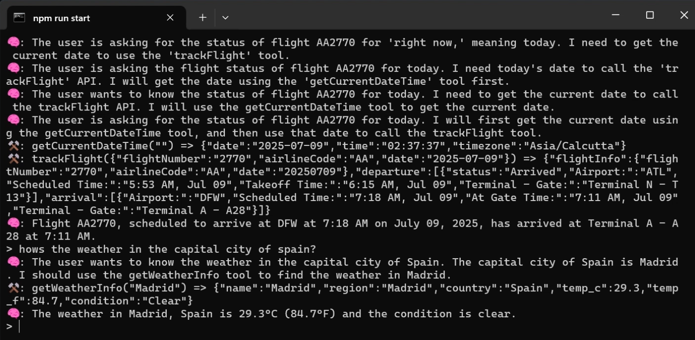

# 🧠 Terminal-Based AI Assistant

An interactive, terminal-based AI assistant powered by Google's Gemini. This agent can answer coding questions, execute custom tools like weather checks, currency conversion, flight tracking, code generation, send Instagram messages and more.

## 🔍 Preview

## ❓How It Works

-   You ask a question in natural language via the terminal
-   LLM responds with reasoning (think), then decides on an action (a tool)
-   Tool output is passed back for final output to you
-   If code is generated with filename, it writes it to disk